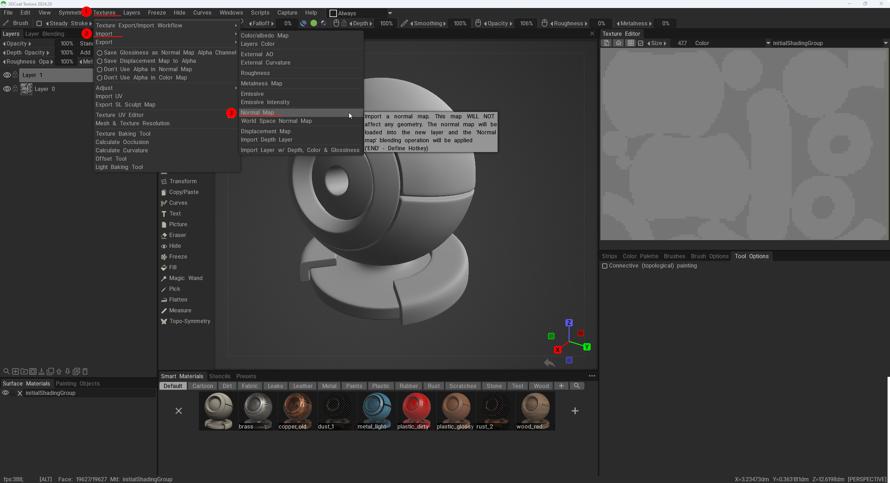
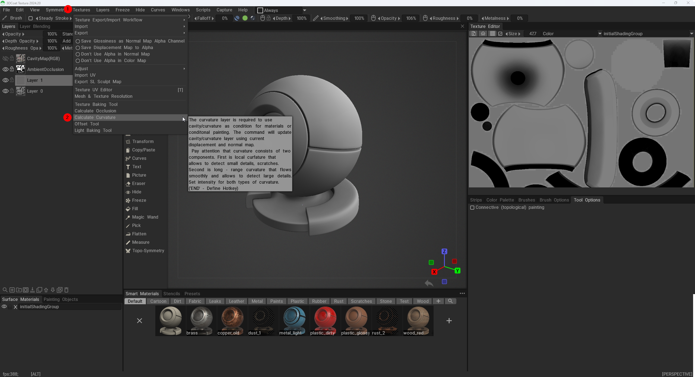
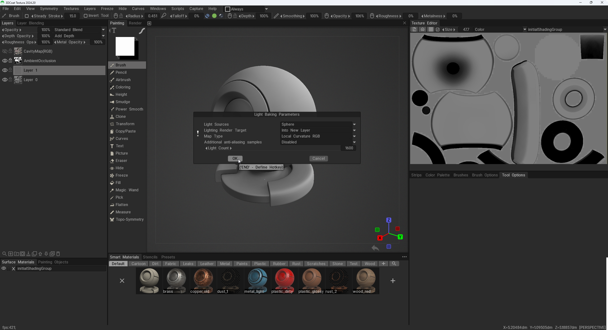
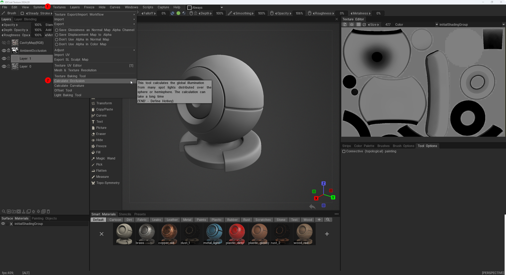
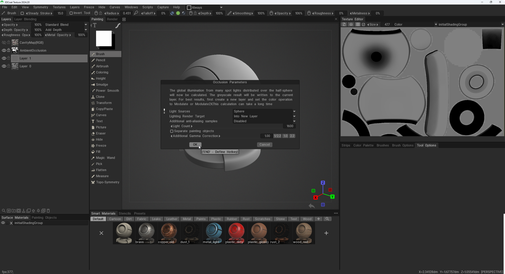

# Maps

[Normal](#normal)
[Curvature](#curvature)
[AO](#ao)

## Normal

To import the normal map created in [xNormal](../XNormal/Baking%20Normals.md#how-to-bake-normals) go to Textures > Import > Normal Map   

## Curvature

To generate a Curvature Map go to Textures > Import > Calculate Occlusion   

The new window that opened up is the settings for the Curvature bake. The default settings in here are fine.   

## Ambient Occlusion

To generate a Ambient Occlusion Map go to Textures > Import > Calculate Occlusion   

The new window that opened up is the settings for the Ambient Occlusion bake. The default settings in here are fine.   