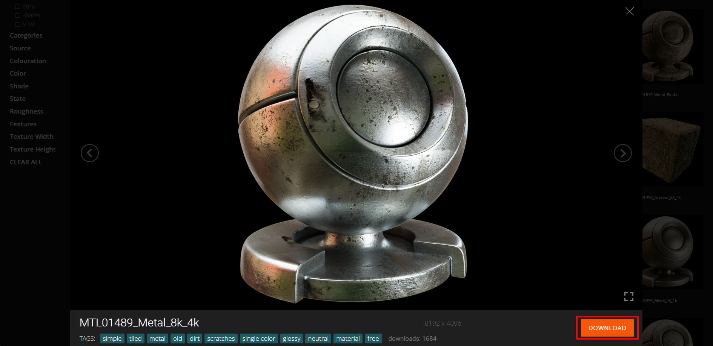
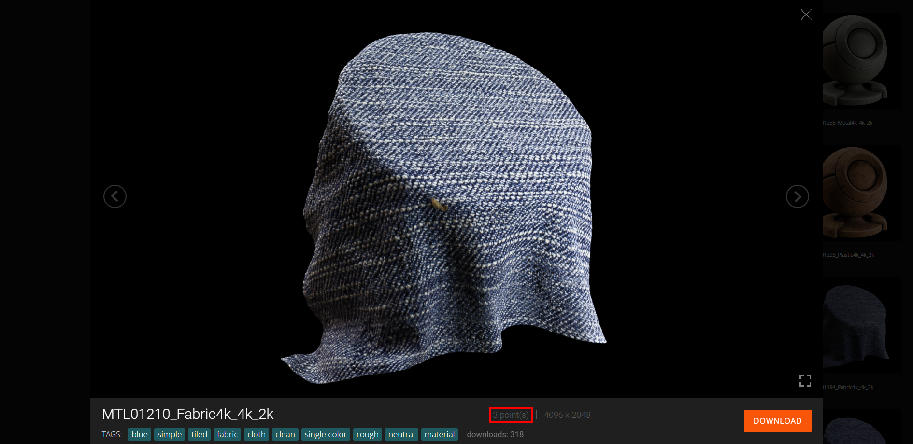
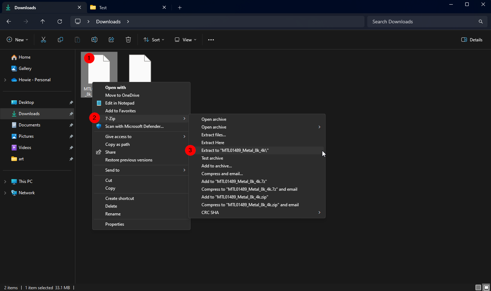
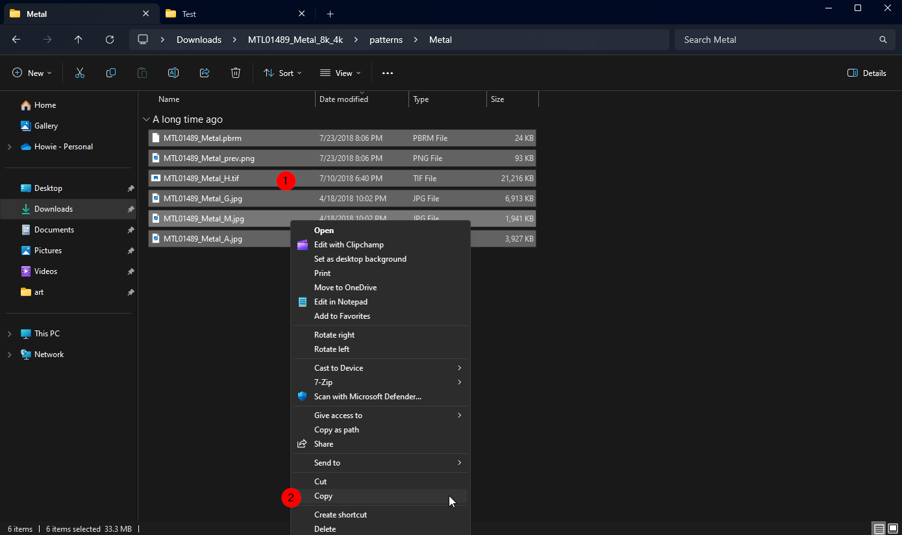
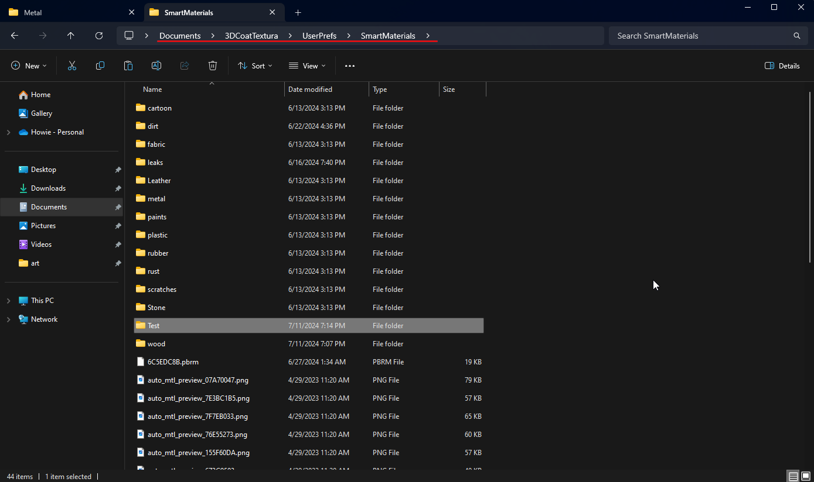
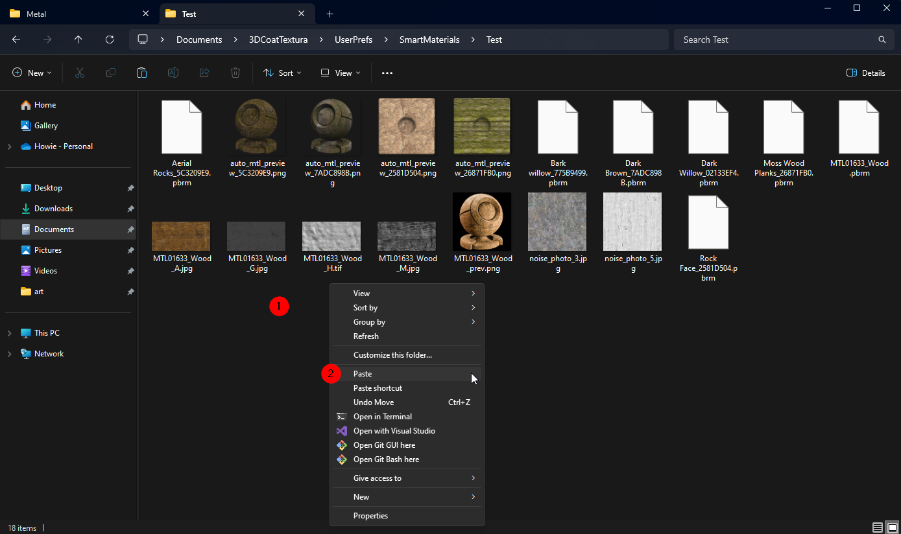
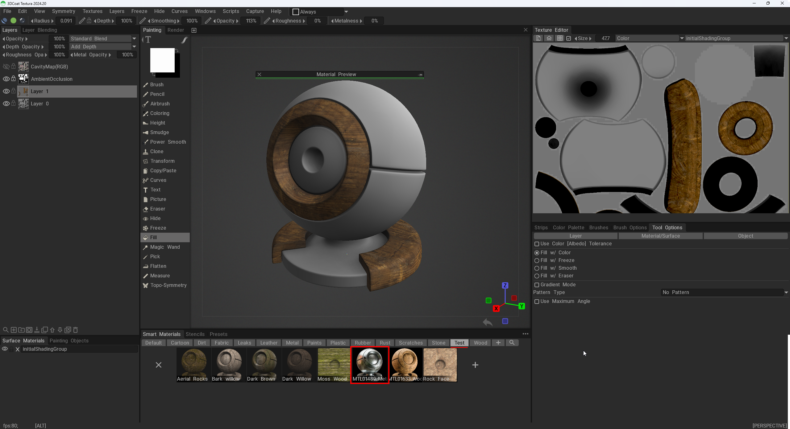
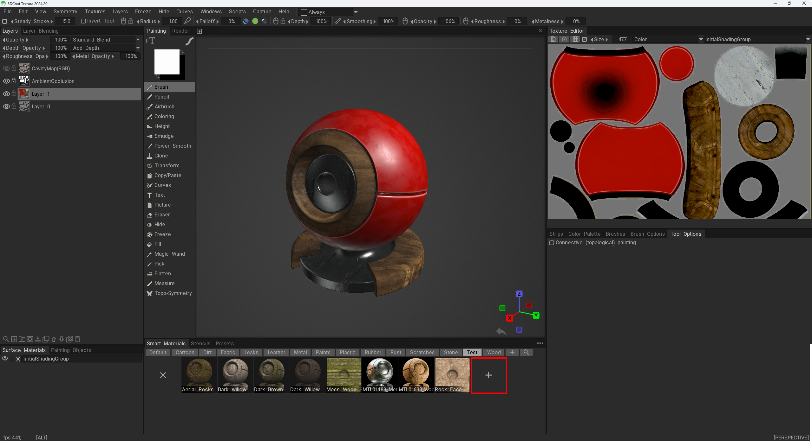
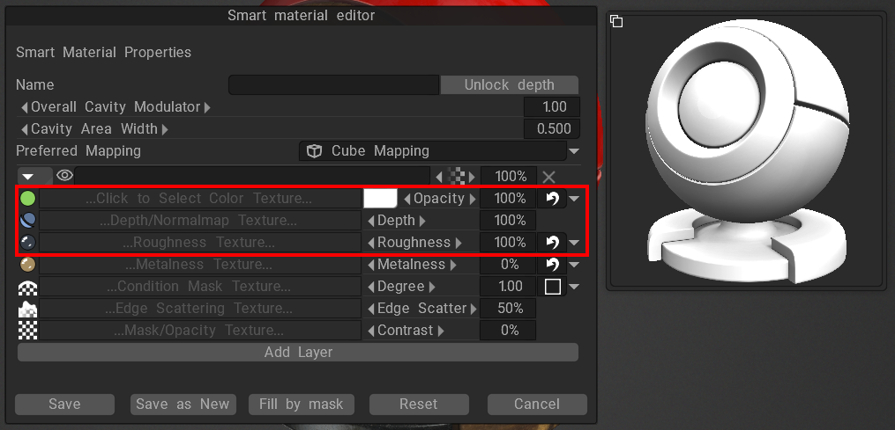
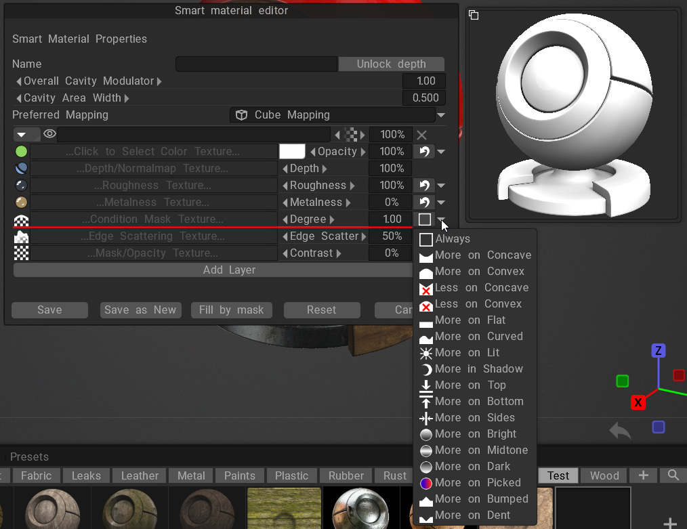

# Smart Materials

[Downloading a material](#downloading-a-material)  
[How to make a Smart material](#how-to-make-a-Smart-material)  
[Using a Smart material](#using-a-Smart-material) 

# Downloading a material

3D Coat has their own website that you can download materials from [PBRLibrary](https://materials.3dcoat.com/scans)

Once you find a material you like download it   

Some materials cost points to download, you get **120 points** a month for free   

Once you have your file down loaded, extract it   

After you extract the file, go into the deepest folder. Select the image files in there and copy them.   

Next head to your Documents > 3DCoatTextura > UserPrefs > SmartMaterials folder. In this folder you will see the groups that 3DCoat haas for grouping materials.   

Find the folder that you want to put you material in and paste it in there. *(In this case a test folder)*   

Now you should see your ne material in 3D Coat   

# How to make a Smart material

You can make a Smart material from either images that you have made or from images from another website like [Texture Heaven](https://polyhaven.com/textures)

Once you have your images click on the + button in the Smart Material   

This will open up a new window where you can add your images   

If you want to add a condition for where the texture can show up, like on only edges you can select the option next to the place to put a condition map   

You can edit the condition with the Degree slider and Contrast

# Using a Smart material

## Painting

## Attaching
