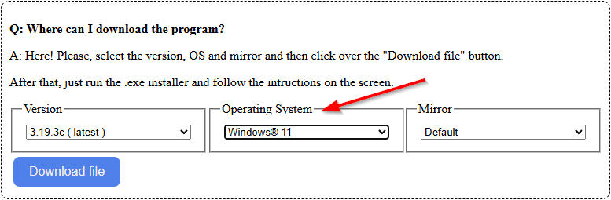

# How to install 3D Coat Tetura

Go to [pilgway.com](https://pilgway.com/products/product-buy/3dcoattextura), buy[^1] and download 3D Coat Textura.

Once downloaded, run the .exe file and follow onscreen instructions

[^1]: If you are joining for a game jam or for a short amount of time you can use the 1 month free trial found [here](https://pilgway.com/download/3dcoattextura).

# How to install Blender

Go to [Blender.org](https://www.blender.org/download/releases/4-1/) and download version 4.1

Once downloaded, run the .exe file and follow onscreen instructions

# How to install Clip Studio Paint

Go to [clipstudio.net](https://www.clipstudio.net/en/), buy[^5] and download Ver. 3

Once downloaded, run the .exe file and follow onscreen instructions

[^5]: If you are joining for a game jam or for a short amount of time you can use the [3 month free trial](https://www.clipstudio.net/en/purchase/trial/?shortlink=4eswztj3&pid=Trial_en&af_xp=custom&source_caller=ui).

# How to install XNormal

Go to [xnormal.net](https://xnormal.net/) and download version 3.19.3. Make sure to select change the operating system to the one you are using.

Once downloaded, run the .exe file and follow onscreen instructions