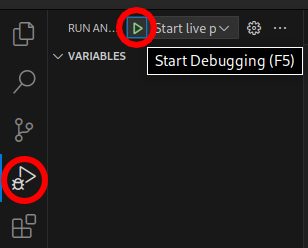
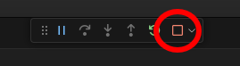

# Live Preview Server

The docs pages can be previewed and updated automatically as you work in a web browser locally.
This can let you see how the docs you are writing will show up on the documentation website before commiting your changes.


## Using Visual Studio Code

This repository includes configuration files that add the live preview server as a run configuration to vscode,
meaning the preview server can be started by pressing F5, or by opening the Run & Debug tab and clicking the start button at the top.



The live preview server can then be stopped by pressing Shift+F5, or by clicking the stop button on the debugger controls.




## Using the command line

Start the live preview server by running the following command.
`--open` can be ommitted if you do not want it to open the page in your browser automatically.
```bash
mdbook serve --open
```
