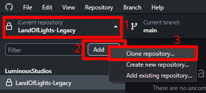
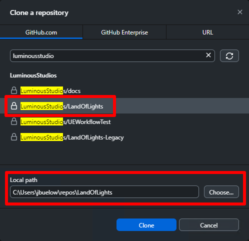
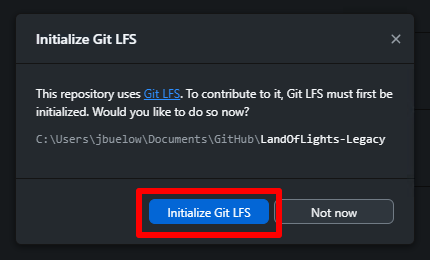

# Cloning the repository

Open GitHub Desktop. If this is the first time using GitHub Desktop, you can click on "Clone a repository from the internet..." in the right sidebar.
Otherwise, select the current repository in the upper left, then click Add, then Clone Repository...

Search for the repository you want to clone, then click Clone. Make sure that the Local path is set appropriately.

This process will likely take some time. Once completed, make sure you Initialize Git LFS once prompted.

You can now open the project in engine! A quick way to open the project folder is to Click "Show in Explorer" under the Repository menu.
