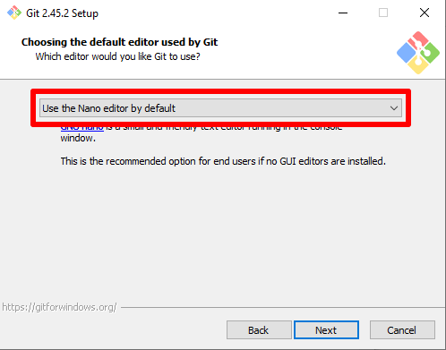
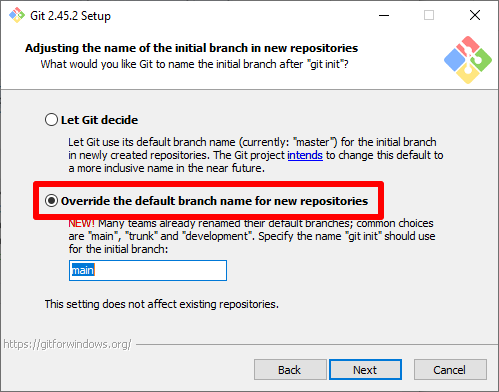
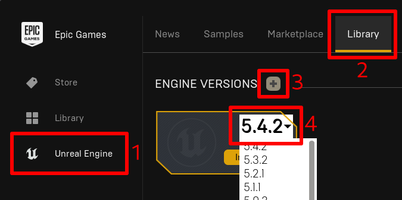

# Installing Software

## Install Git

Go to [git-scm.org](https://git-scm.com/download/win) and download the latest version using the "64 bit Git for Windows Setup" link. Then, run the installer.

The installer has may options that it will ask you to configure, and most can be left at their defaults. However it is recommended to change the following:

Change the default editor to nano.

Change the default branch name to `main`

## Install GitHub Desktop

Go to the [GitHub Desktop Download Page](https://desktop.github.com/download/) and download the installer. Then, run the installer.
No steps are needed during installation, but you will need to sign in to GitHub the first time GitHub Desktop is ran. The installer should run it automatically.

Sign in to GitHub using your browser, and allow it to open the link in GitHub Desktop once signed in.
You will be asked to Configure Git with a name and email address. The name used *does not* have to match what is on your GitHub account!

## Install Visual Studio

Go to the [Visual Studio Download Page](https://visualstudio.microsoft.com/) and download the installer for Community 2022. Then, run the installer.

During installation you will be prompted to select what componenets of Visual Studio you want to install.
Make sure that the following options are selected, then click install.
- Under the Workloads tab:
    - .NET desktop development
    - Game development with C++

## Install Unreal Engine

Go to the [Epic Games Launcher Download Page](https://store.epicgames.com/en-US/download) and download the installer. Then, run the installer.

Once installed, sign in with your Epic Games account. Then, go to the Unreal Engine section, Library tab,
and add a new engine version with the correct version for the project.

