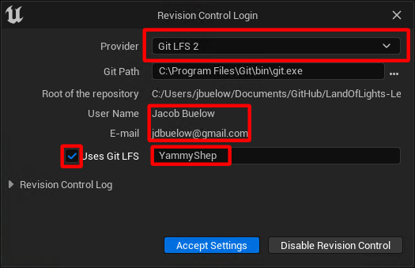

# Opening the project

Once you have [installed all the appropriate software](./install.md), and [cloned the repo](./clone.md), you can open the project in Unreal Engine.
How this is done will vary slightly for each project and if you are an Artist or Engineer.
If you are an engineer, you will likely want to launch the project using Visual Studio or Jetbrains Rider.
If you are an Artist, use the editor launch script if it is included with the project, or using the uproject file directly.

## Revision Control Settings

The first time you open the project, you will need to setup the revision control settings inside of Unreal Editor in order to work with the Git repository.

Click "Revision Control" in the bottom right corner of the editor, then click "Connect to revision control...".
For provider, select "Git LFS 2" and make sure it correctly pulls your git username and email address.
Also make sure that "Uses Git LFS" is checked and that the username to right of the checkbox **matches your GitHub username**.
This will likely be auto-filled incorrectly; Setting this incorrectly *will* cause issues when locking assets!

If the provider list does not include "Git LFS 2" but instead includes "Git (beta)", contact the repository administrator for help.
Either the project is incorrectly configured or there is an issue preventing source control plugins from properly loading.

