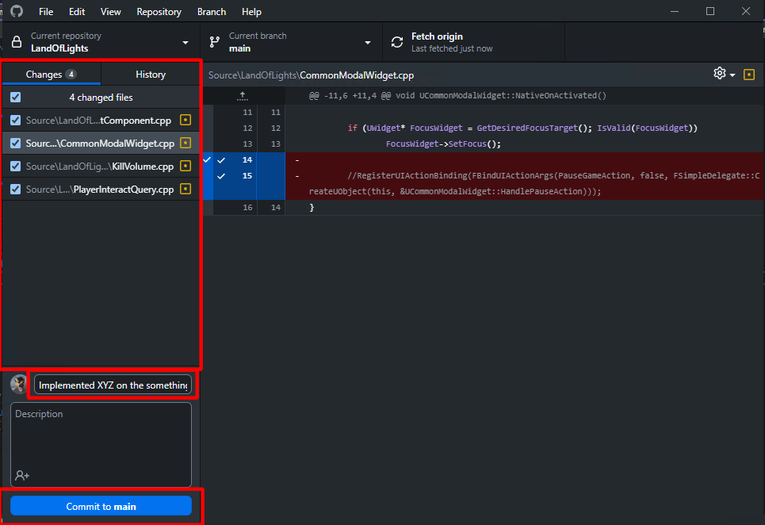
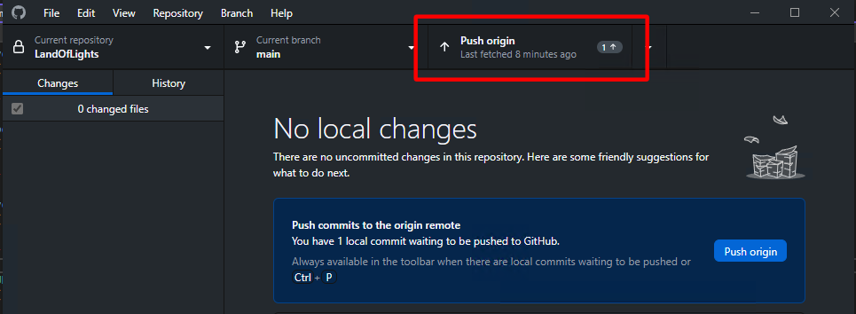
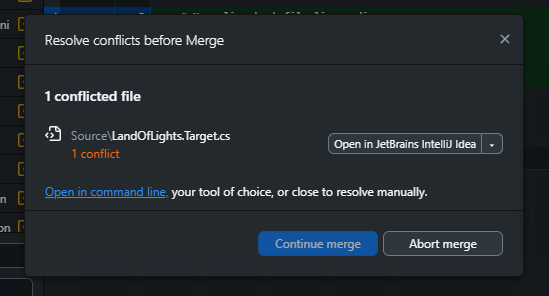

# Submitting work out of engine

Work done outside of Unreal Editor must be committed using GitHub Desktop or another git client,
as the source control feature in Unreal Editor only keeps track of asset changes.

Unreal Editor must be closed before continuing.

## Commit Changes
Once Unreal Editor is closed and all work is saved, open GitHub Desktop and make sure the project's repo is selected.
Any files that have been changed will be listed on the left side of the screen. Check the files you want to commit,
then write a message in the summary field at the bottom.
Once you are done, click the commit button at the bottom. This will commit the files locally,
**but does not push to the server, so your changes are not avaliable for others yet!**

## Push Commits
Once you have made the commit locally, you must push it to the remote repository for others to view and work off your changes.
This can be done in GitHub Desktop by clicking on the Push origin button located at the top of the window.

## Merging with Remote
If this button instead says "Pull origin" after making your commit,
you must first pull down changes made by others and merge them before you can push your commit.
Often, this can and will be done automatically, in which case GitHub Desktop will automatically perform the merge and then push your work.
However, if you made changes that conflict with changes made by others,
this will cause a merge conflict that must be resolved manually before you can push your commits.

If you have experience with diffing and merging, you can attempt to resolve these conflicts,
otherwise reach out for help in the project's Discord.
