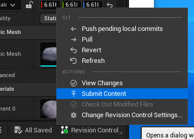

# Submitting Work in Engine

Once you have finished working in engine, you need to submit your changes back to the repository for others to see and use.
This can be done using the Submit Content menu, found under the Revision Control tab in the lower right corner of the editor.

Then add a commit message in the box provided, and select the assets you want to commit before clicking commit.
This action will both commit to the git repository, and push the local commit to the remote repository in one action.