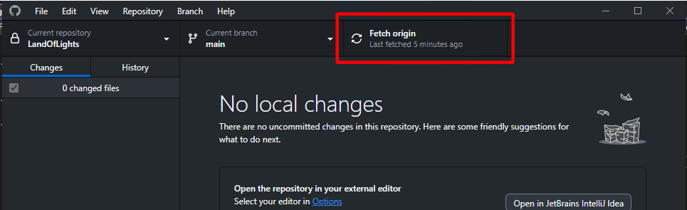
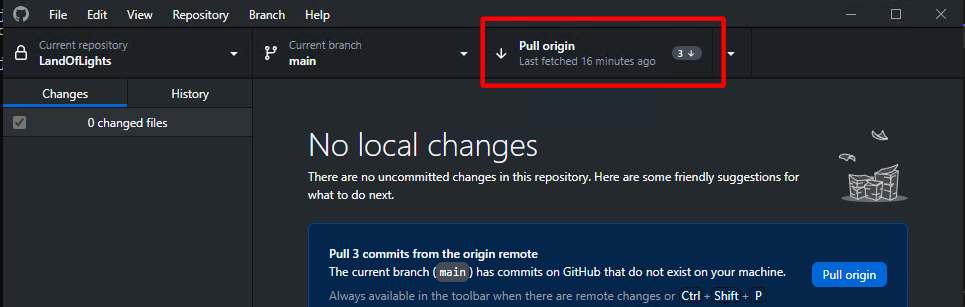

# Updating the project

You must update the local working copy of the project before you begin working in it.
This can be done using GitHub Desktop or another git client.

Open GitHub Desktop and make sure the correct repository is selected.
If you have any pending changes, you should either commit them or discard them before updating.

Click Fetch origin. This makes git aware of new changes made by others on the server.

Once you have fetched remote changes, you must pull to apply them to your local working copy.

Your local working copy is now up to date and you can open the project in engine.
